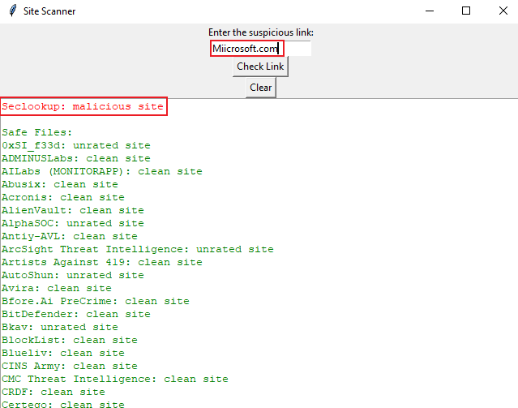

# Site Scanner

## Introduction
The Site Scanner program is designed to check if a link is suspicious or not by utilizing the VirusTotal API. This tool can help users identify potentially harmful links and take appropriate precautions.

**Disclaimer:** Please note that while this tool can be used for legitimate purposes, it can also be misused for malicious intents. The author does not endorse or support the use of this tool for unethical or illegal activities.

## Prerequisites
Before using this program, ensure you have set up the `VIRUSTOTAL_API_KEY` environment variable with your VirusTotal API key.

## Usage
1. Enter the suspicious link in the provided entry field.
2. Click the "Check Link" button to analyze the link.
3. The program will display the analysis results, indicating whether the link is suspicious or safe.

## Screenshots

This deceptive domain, closely resembling the legitimate 'microsoft.com', exploits common typographical errors to mislead users.

## Acknowledgements
- The Site Checker program was created for RowdyHacks 2024 by Team Coderunner.
- Special thanks to the VirusTotal API for providing the necessary functionality to analyze links for potential threats.
